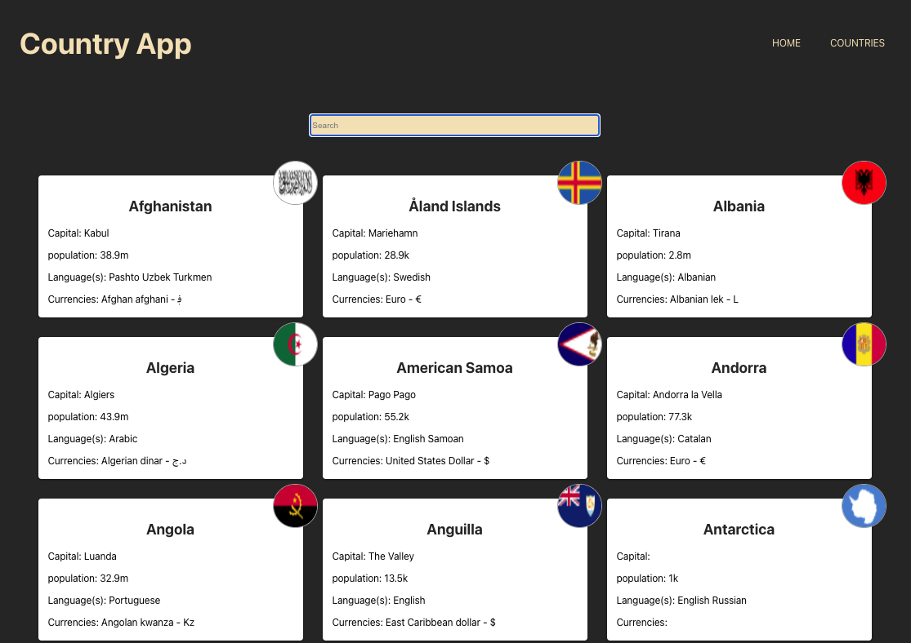
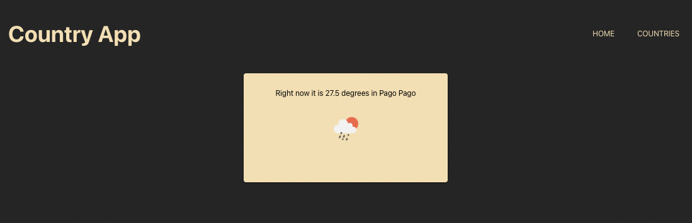

# Country App

- This app displays information (name, capital, population, languages, currencies) of all countries in the world
- When each country card is clicked, real-time temperature of that specific capital will be displayed
- Taking data from api (https://restcountries.com) (https://openweathermap.org)

### Screenshot

